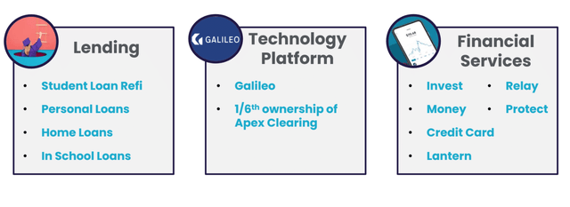

*Grace Ho, April 2021* 

# SoFi
## **Overview and Origin:**
**Social Finance Inc** is a San Francisco-based online provider of a broad range of financial products, covering borrowing, saving & transactions, investment and insurance.  The company began 10 years ago as a student loan provider, and soon broadened to other loans, investment & insurance products.  SoFi has also been making a number of large acquisitions, including recently, Galileo, a payments processing platform used by other fintechs including SoFi’s competitors.  The acquisition sets up SoFi to be like the Amazon of fintech, offering products for retail customers and platform solutions for B2B clients.

SoFi currently provides its retail offering to residents of USA.  In early 2017, the company had raised $USD500m of funds with the intention of expanding into Canada & Australia.  However, by the end of 2017, SoFi announced it would pull back the intended international expansion plans and focus instead on expanding the product range in its home market of the USA.

SoFi is seeking to list on the stock exchange in 2021 through merger with a special purpose acquisition corporation (SPAC).

### Name of company
- **Social Finance Inc**, also known as **SoFi**.
 
### When was the company incorporated?
- SoFi was incorporated in 2011, and is currently headquartered in San Francisco, USA. 

### Who are the founders of the company?
- The founders were four students who met at the Stanford Graduate School of Business: Mike Cagney, Dan Macklin, James Finnigan, and Ian Brad.  All four have since left SoFi (some in controversial circumstances) to pursue other opportunities including starting other successful fintechs and financial companies.

### How did the idea for the company (or project) come about?
- SoFi began as an experiment conducted by the four Stanford Business School friends. They wanted to address the flawed student loan system that buried many young Americans in debt. The inaugural SoFi program connected 100 student borrowers with 40 Stanford alumni, who personally financed $2m of loans at an average of about $20,000 each. All parties benefitted from the arrangement: the students received funds at an improved interest rate, the alumni lenders collected a return on their investments, and SoFi retained a cut of the interest as their revenue. 

- The flagship student loan program then expanded significantly, within four years of the initial $2m loan, SoFi became the largest student loan provider on the planet.

- SoFi have continued to broaden their product offering to this day, seeking to identify other areas where they can improve the financial experience and outcomes for customers.  This has led the company to provide products in 11 different offerings, including a no-fee bank and savings account, debit and credit cards, student loans, mortgages, investments, auto/life/homeowners/renters insurance, as well as lending and planning services for small businesses. 
- The company has also expanded beyond the retail consumer space, into the B2B space by providing payments & bank account infrastructure for other fintechs via its recent purchase of Galileo.

### How is the company funded? How much funding have they received?
- The company has received multiple rounds of funding, with total funding raised to date of $3b USD.   Funding has been received from some large corporates & significant investors, such as Morgan Stanley, Peter Thiel, Qatar Investment Authority to name just a few. 

## **Business Activities:**
### What specific financial problem is the company or project trying to solve?  
- SoFi originally sought to improve the situation for students in the USA, who are burdened with large, high interest student loans.  SoFi wanted to lower the costs for students, while finding a way for alumni to invest in the students and earn a return.  The target was a slice of the $1.2 trillion student loan market in the USA.  
- The focus has since expanded, and according to the organisation’s mission statement, they now seek to “help our members achieve financial independence to realise their ambitions”.  SoFi are now seeking to be the sole provider of financial services for members over their needs lifecycle with improved products, services and rates.
### Who is the company's intended customer?  Is there any information about the market size of this set of customers?  What solution does this company offer that their competitors do not or cannot offer? (What is the unfair advantage they utilize?)
- Specifically, SoFi targets what is referred to as ‘HENRY’ (High Earners Not Rich Yet) customers, that is, customers who are 22+ years old with incomes $100k and above.  SoFi refers to these customers as ‘HENWS’, (High Earners, Not Well Served), reflecting SoFi’s position that there are significant opportunities to improve the financial sector’s offering in terms of: convenience & flexibility, interest rates & returns, information & knowledge, and providing the full financial experience in one place.
- SoFi is seeking to be the one-stop shop for a member’s lifetime financial needs, covering transaction & savings, loans of many types, insurance, and investment (including information & advice).  The goal is to get customers to sign up for more than one financial offering, which allows the company to lower its customer-acquisition costs and create a more seamless experience across the product set.  
- SoFi is currently progressing towards obtaining a national bank charter in the US, and has recently announced it has purchased a small US bank Golden Pacific Bancorp to support their goal of disrupting traditional banking.
- As SoFi has such a broad product range, the markets that SoFi is targeting are quite large, representing trillions worth of opportunity.  With the recent expansion into B2B and payments platform infrastructure market, the market size that SoFi is targeting has again expanded significantly.
- SoFi's current product offerings can be split into the below categories:

- SoFi has a dual approach of ‘member experience’ & ‘full suite of products’, which provides their advantage to target the customer base of incumbent banks and also fend off other fintech providers.  Against incumbent banks, SoFi’s newer technology provides a fast & efficient experience, which results in cheaper offerings to customers.  Against both the incumbents and other fintech providers, SoFi seeks to provide all the solutions needed for the lifetime financial needs of members, seeking to be the one-stop financial shop in one mobile app.  
- This dual approach to retail customers has been further leap-frogged with the recent purchase of B2B offerings, including Galileo, which is a payments processing & bank account infrastructure platform used by other fintechs, including SoFi’s own competitors.  
- SoFi is likened as an aspirational ‘Amazon of Fintech’, with it’s two pronged approach of reaching both retail and B2B customers, similar to Amazon’s retail and AWS offering.  SoFi itself also refers to this strategy as ‘Winner [in the category] takes Most’, and sees Amazon as an example of an industry leader they aspire to be.

### Which technologies are they currently using, and how are they implementing them? (This may take a little bit of sleuthing–– you may want to search the company’s engineering blog or use sites like Stackshare to find this information.)
- SoFi utilises numerous technologies, among them Galileo’s technology for its cash management, and account services products.  
- According to Builtwith and SoFi’s own job advertisements, SoFi’s primary stack is java / kotlin / react / typescript on Kubernetes / docker.  Their technology stack includes: Kotlin, Java, SpringBoot, webflux, graphQL, mysql, Cassandra.  They use APIs in a Java/Kotlin, SpringBoot, Hibernate, Postgres, and Kafka stack deploying to AWS cloud using Docker with Kubernetes.

## **Landscape:**
### What domain of the financial industry is the company in?
- SoFi is primarily within the Personal Finance domain, however it has now expanded into the B2B financial platforms domain as well.  
### What have been the major trends and innovations of this domain over the last 5-10 years?
- The incumbent financial players have traditionally benefited from their significant power and market share.  This has allowed them to lend at higher rates & charge fees; provide slower than desired services; and built offerings based around product sets rather than customer needs which resulted in customers holding relationships with multiple financial organisations to meet their needs.
- Over the past 10 years, we saw the entry of tech giants into the financial space to deliver improvements to some of these issues, such as the virtual wallet technology from the likes of Alibaba, Apple, Samsung.  There has also been a significant increase in fintech players seeking to meet the needs of the mobile-first consumers and lower the cost of banking through technology.  
- As the domain matures, we are seeing more acquisitions in the space.  However, there have been some stumbling blocks for big fintech players in the domain in recent years.  Examples include, Ant Group not allowed to go to IPO due to government intervention; and Visa’s acquisition of Plaid rejected due to antitrust concerns. SoFi face some of these regulatory hurdles as it continues to grow and make further acquisitions.

### What are the other major companies in this domain?
- Due to the breath of SoFi’s product offerings, competitors in their domain are many.  From a fintech start-up perspective, some of the other players similar to SoFi include LendingClub (consumer finance & credit cards); LendKey (Internet Software, lending platform); and earnest (diversified financial services). Others include Chime, Plaid, Credit Karma, Revolute, Klarna, and Qudian.  However, none of whom have the business model diversification that SoFi has achieved. 
- SoFi’s ambition is so broad that its competitors also include the incumbent banks (eg Wells Fargo, Bank of America, Citigroup, JP Morgan Chase) & wealth managers (eg Goldman Sachs), investment fintechs (such as Robinhood). 
- Looking forward, it would be expected that there would be more merging in the domain of large tech giants as they move in and disrupt the big banks (eg Apple or Amazon), traditional banking moving into the personal finance fintech domain especially through acquiring newer fintechs, traditional wealth & investment banks becoming like technology companies, and current fintechs undergoing further consolidation. 

## **Results:**
### What has been the business impact of this company so far?
- SoFi has grown significantly in the 10 years since incorporation.  At Jan 2021, the company now claims $50 billion in funded loans, more than 1 million members and over $22 billion in paid-off debt.  
- Despite the significant growth (including 74% increase in their credit card customers within 12 months), SoFi is still a small financial player based on book size, when compared to the incumbent banking giants.  For example, the top 5 US banks have a combined lending book of more than $3.8 trillion dollars (this only represents 40% of all loans provided by US commercial banks), compared with SoFi’s $50b. 
- However, the continued growth of the company, the expansion of its product set into new domains, places it to be a potential threat in years to come.
### What are some of the core metrics that companies in this domain use to measure success? How is your company performing, based on these metrics?
- Some core metrics that SoFi uses to measure itself are more leading indicators, which is appropriate for a newer entrant seeking to grow.  These include: 
    * loans opened / day, 
    * total members (expecting 3m in 2021),
    * member growth (expecting 75% growth in 1 year in 2021, 
    * multi-product members (expecting 775k in 2021, which will be double in 1 year), 
    * total products (expecting 4m in 2021, up 77% in 1 year),
    * Life time value (LTV) per customer, and CAC (customer acquisition cost).

- The more traditional metrics used by financial organisations include:
    * Total lending and deposit held
    * Revenue
    * Margin %
    * Earnings before Interest, Tax, Depreciation & Amortisation (EBITDA)

- Against the traditional banking giants, SoFI’s metrics remain small.  For example:
    * Total value of lending in US by all commercial banks is $14.9 trillion dollars, compared with SoFi at around $50 billion; 
    * JP Morgan Chase was the highest revenue earning Bank in 2019, with $142b total revenue, compared with SoFi who are expecting $1b revenue in 2021.
    * Total USA Banking customers hold over 500m bank accounts (50% are held with the top 10 legacy banks), while SoFi is expecting to have 3m members in 2021 (holding 4 million total products).
- Based on these metrics, SoFi is still considered a small, niche player in the financial services sector, albeit fast growing with significant potential to take further market share from incumbents. 

### How is your company performing relative to competitors in the same domain?
- There are many fintech entrants in the personal finance domain.  However SoFi is the largest when compared with the other new online lending entrants.  Key competitors in the personal finance domain include:
    * RateSetter - (also known as Retail Money Market) is a company developing a peer-to-peer investment platform.
    * Funding Circle - Funding Circle is a company developing an SME lending platform that enables small businesses to access finance directly from investors.
    * Avant - Avant is an online platform and a provider of credit alternatives to middle income consumers.
    * Lending Club - is an online financial community that brings together creditworthy borrowers and savvy investors.
    * Upstart - is a provider of a cloud-based artificial intelligence lending platform.
    * LendingTree - is an online lending exchange that connects consumers with multiple lenders, banks, and credit partners who compete for business.
    * CommonBond - is a provider of an online lending platform that connects borrowers and investors.

- The largest of these competitors is Lending Club, which has a similar sized lending book to SoFi, but lacks the product diversification that SoFi offers.
SoFi’s product range is broader than the competitors in the personal finance domain.  For example, Robinhood and Coinbase are also competitors of SoFi in the wealth & investment space, however, they don’t offer the array of other financial products that SoFi provides. 

## **Recommendations:**
### If you were to advise the company, what products or services would you suggest they offer? (This could be something that a competitor offers, or use your imagination!)
- The company’s product offering is already so broad covering the full array of personal financial products and further into B2B financial platforms.  One concern is whether they are able to effectively grow both the breath and depth of their offering at the same time, and capture the cross benefits of owning a B2B technology platforms business and a retail financial business.  There is a risk that the organisation grows too quickly and is unable to adequately focus on bringing the best solutions to each of its service offerings.  So far, the organisation has been able to attract key talent with the relevant financial and technology skills to lead their expansion and growth ambitions.
- Instead of further expanding their product & service offering, my recommendation is that they continue to growth into new but complimentary jurisdictions.  One key example of this would be Canada, where the US banking incumbents also have a similar foothold and there are some similarities and connections between the two jurisdictions.   
- SoFi in early 2017, considered an expansion to Australia, although pulled back from this plan by the end of 2017.  I would not recommend entering Australia at this time due to the significantly different regulatory regime for banking in Australia.  While it would also provide some economies of scale, the regulatory hurdles in set up and differences in customer behaviours (eg financial knowledge, needs & expectations) would be a significant distraction for the company while they bed down their broad product set. 
### Why do you think that offering this product or service would benefit the company?
- This product & service expansion into a complimentary jurisdiction such as Canada would provide further economies of scale, and allow increased value to be derived off SoFi’s existing technology investment and architecture. This ultimately decreases the technology cost to serve per customer and improve overall margins & profitability. 
### What technologies would this additional product or service utilize?  Why are these technologies appropriate for your solution?
- The technologies required should already be within SoFi’s technology stack. There may be some slight changes needed in terms of data or processes to stay compliant with Canada’s regulatory requirements. 

___
## **Source:**
- Wikipedia, 8 Apr 2021.  https://en.wikipedia.org/wiki/SoFi#:~:text=(commonly%20known%20as%20SoFi)%20is,mobile%20app%20and%20desktop%20interfaces.
- https://www.fool.com/investing/2021/04/05/how-sofi-and-robinhood-are-changing-the-ipo-game/
- https://www.businesswire.com/news/home/20210406006079/en/SoFi-Launches-Auto-Loan-Refinancing-Through-Lantern
- https://www.bloomberg.com/news/articles/2021-04-05/auto-loans-get-their-sofi-moment
- https://www.businessinsider.com/personal-finance/sofi-invest-review?r=AU&IR=T
- https://www.ironedgevc.com/post/whats-so-special-about-sofi#:~:text=Founded%20in%202011%2C%20SoFi%20started,James%20Finnigan%2C%20and%20Ian%20Brady.&text=With%20the%20way%20the%20marketplace,identifying%20other%20areas%20of%20need.
- https://www.forbes.com/sites/petercohan/2021/01/08/3-reasons-to-buy-sofi-stock-after-its-spac-ipo/
- https://www.crunchbase.com/organization/social-finance/company_financials
- https://columbiaventurepartners.medium.com/sofi-the-financial-future-for-gen-z-millennials-4d76d4956888
- https://www.pymnts.com/news/ipo/2021/sofi-social-capital-merger-will-fuel-growth-of-one-stop-shop-financial-supermarket/
- https://lastfuturist.com/will-sofi-become-the-amazon-of-fin-tech/
- https://www.spglobal.com/marketintelligence/en/news-insights/latest-news-headlines/update-sofi-going-public-via-spac-deal-with-profitability-expected-in-21-62020258
- SoFi Investor Call deck, 2020. https://www.dropbox.com/s/ffybqu77l1z4wxu/SoFi%20Investor%20Call%20Deck%20.pdf?dl=0
- https://digital.hbs.edu/platform-digit/submission/sofi/
- https://www.bankingdive.com/news/sofi-acquisition-galileo-deal/575703/
- https://stackshare.io/sofi/sofi
- https://www.statista.com/statistics/185488/leading-us-commercial-banks-by-revenue/
___
